# FlowFocus: Daily Planner

[FlowFocus: Daily Planner](https://annibor.github.io/flowfocus-daily-planner/)

# Introduction

Welcome to FlowFocus, your daily planner to help you achivie your goals, reduce stress and get more organized. In the society we live in today it's easy to feel overwhelmed by responsibilities and evaryday things that triggers stress. FlowFocus is the app thats here to help you to get a more organized everyday life, so you can save your energy for what matters to you, stay in the flow and boost your productivity effortlessly.

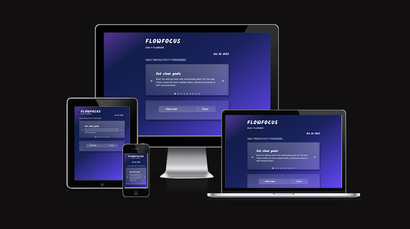

## Table of Content

- [**FlowFocus: Daily Planner**](#flowfocus:-daily-planner)
  - [**Table of Content**](#table-of-content)
  - [**Planning & development**](#planning--developmnet)
    - [**Project Goals**](#project-goals)
    - [**Wireframes**](#wireframes)
      - [**Home Page**](#home-page)
    - [**Colors**](#colors)
    - [**Fonts**](#fonts)
    - [**Design Philosophy/ Features**](#design-philosophy-features)
  - [**Testing**](#testing)
  - [**Devtools**](#devtools)
    - [**Ligthouse**](#lighthouse)
      - [**Issues**](#issues)
      - [**Results**](#results)
  - [**Deployment**](#deployment)
  - [**Languages**](#languages)
  - [**Software**](#software)
  - [**Media**](#media)
  - [**Usage**](#usage)
  - [**Modification**](#modification)
  - [**Distribution**](#distrubition)
  - [**Private Use**](#private-use)
  - [**Liability**](#liability)
  - [**Credits**](#credits)
  - [**Content**](#content)
  - [**Special thanks**](#special-thanks)
  - [**What I've learned**](#what-ive-learned)

## Planning & developmnet

### Project Goals

My primary goal with FLowFocus was to create a user-friendly and effective everyday planner, that could help users to organize their tasks ans enhance their productivity. One goal was to provide a solution that encourage self-care, task proritization and goal setting for users to ease their everyday stress.

### User-Centered Approach

The user is placed in the center of the development process, to make sure that the end result would be a userfriendly and user proritized website.

#### As a General user

- FlowFocus is for anyone that is looking for a way to get more organzed in their everyday life.

#### As a Student

- With FlowFocus you can get your tasks in order, and have a clear overview of everything that needs to be done, homework, assigments or small goals that you need to do before the big sumbmission date that's up ahead.

#### As a Business Owner

- FlowFocus can help you to manage your daily tasks and other responsibilities that comes with owning a business. With this app, you could keep you head clear and focus on the task your doing right now, and once your done, mark the task that's done, and move on to the next thing on your to do list.

#### As a New User

- If you're new to FLowFocus, you'll discover a welcoming and easy navigated interface. The app is designed with the mind of "Less is more", to make sure that nothing easily could distract the user.

### Wireframes

I've created my wireframes for the website by using [Balsamiq](https://balsamiq.com/). I created one wireframe for mobile, tablet and desktop on each page of the website.

#### **Home page**

- [Wireframes for desktop](./docs/wireframes/homepage-desktop-wireframes.png)
- [Wireframes for tablet](./docs/wireframes/homepage-tablet-wireframes.png)
- [Wireframes for mobile](./docs/wireframes/homepage-mobile-wireframe.png)

#### **When Task added**

- [Wireframes for desktop](./docs/wireframes/add-task-desktop-wireframe.png)
- [Wireframes for tablet](./docs/wireframes/add-task-tablet-wireframe.png)
- [Wireframes for mobile](./docs/wireframes/add-task-mobile-wireframe.png)

#### **Change slide**

- [Wireframes to change slide](./docs/wireframes/change-slider-wireframe.png)

#### **Add task**

- [Wireframes for add a task](./docs/wireframes/enter-task-wireframe.png)

#### **When task is done**

- [Wireframes for when task is done](./docs/wireframes/click-check-wireframe.png)

#### **Edit button**

- [Wireframes for edit button](./docs/wireframes/edit-button-wireframe.png)

### Colors

- I used [Coolors](https://coolors.co/) for making a color palette for the website. The color are called : #102E4A
  #55C1FF
  #5887FF
  #715AFF
  #A682FF

I've embraced various shades of blue to align with the design principle of "Less is more." Blue is universally favored, and it provides an elegant contrast to the white text, creating a clean and stylish visual.

- 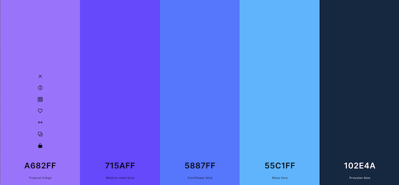

I used [Tint and Shades](https://maketintsandshades.com/) to find different tints and shades of the colors from the original color palette. The shades used on this site were: #1A0066
#002EA3
#500AFF

- 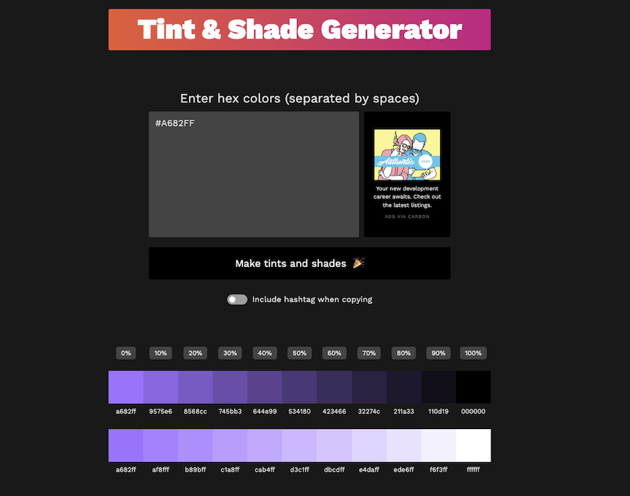

I used [Color Contrast Shecker](https://coolors.co/contrast-checker/112a46-acc8e5) to make sure I used colors that had good contrast to eachother.

- 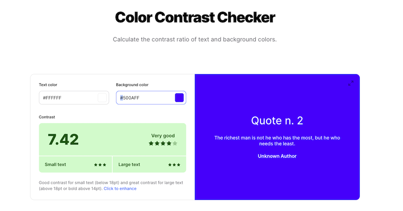

I used [CSS Gradient](https://cssgradient.io/) to make the gradient background for the page.

- 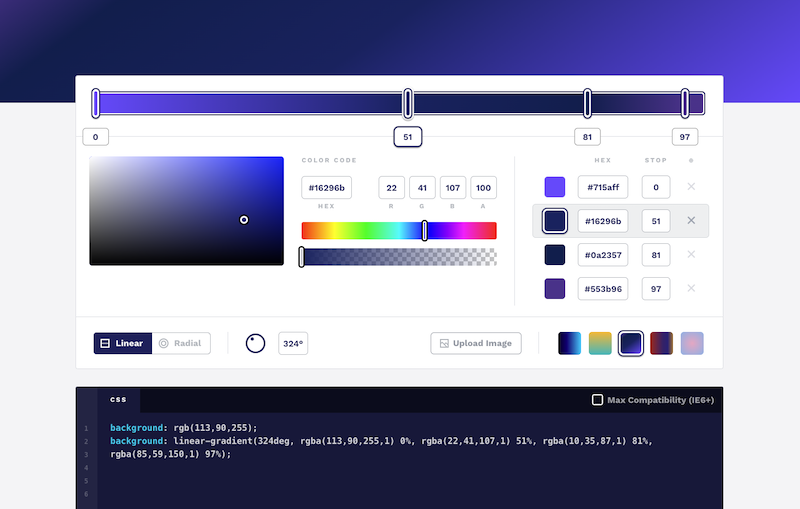

### Fonts

- I used a font called Inter as a base for the page. This is the font used on the subheading on the logo, the heading for the slider and on the text on the page.
- For the logo, date, slides headings and the text on the to do inputs I used a font called Kalam. This to get add some dimention for the webpage, without making it overwhelming.

### Design Philosophy/ Features

- **Homepage**:
- 
- 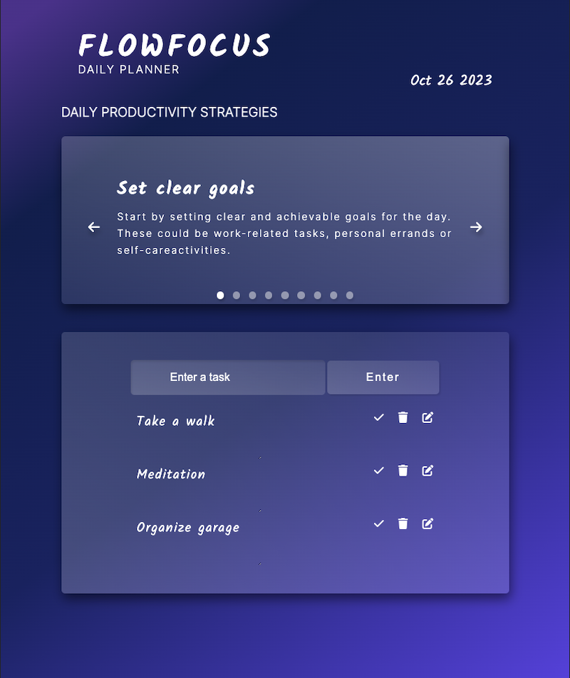
- 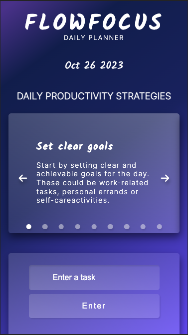

- **Header**: A responsive navigation bar,

- 
- 
- 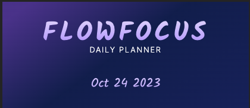

- **Slider**: A responsive slider section. You can flip through the slide by clicking the arrow buttons, but you can also flip through them buy clicking the left or right arrow key on your keyboard.

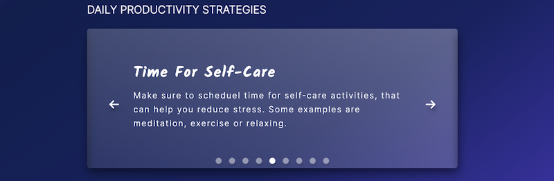
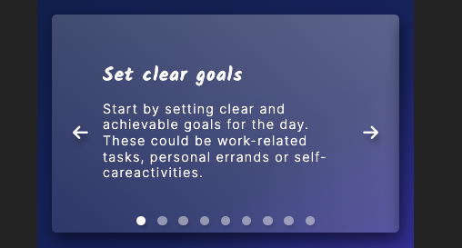

- The app automaticly dispalys todays date on the page.

- 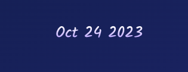

- The slider has dots to indicate what slide your on in the slider.

- 

- **Todo List**: A responsive todo list.

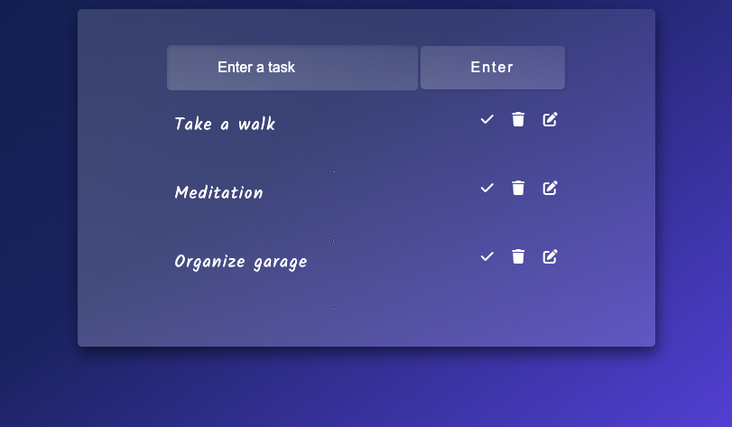
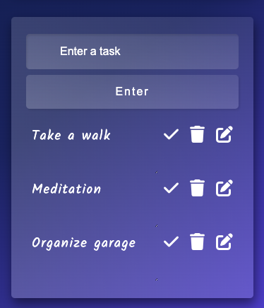

- **Enter Task**: In this input, you can write your task, andd then simply click on the button called eneter, or the enter key on your you keyboard.

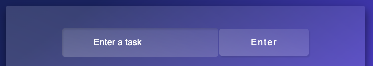

- **Done**: Once your done with one task, and click on the check,the task gets a line over it, to clearly mark it as done.

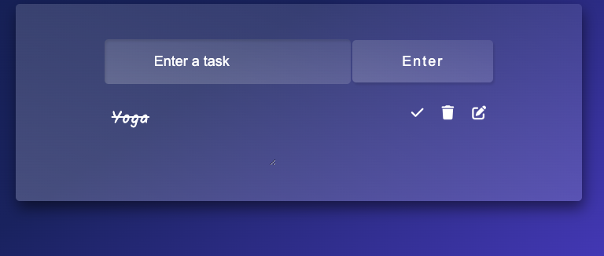

-**Edit**: If you want to change or edit one task, you just click on the edit button, that opens the textarea again, adn this time with a save and cancel button as well.

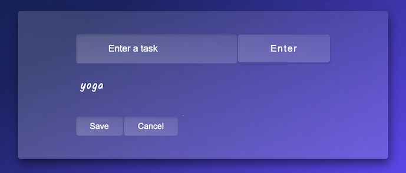

### Future Features

Future features for the webpage are:

- A footer with links to social media.
- Being able to mark todo'd as important.
- A way to get reminders of todo's the user mark as important.
- Add audio for button clicks.
- Make heading and subheading gradient in color.
- A function to share lists with others.

## Testing

- Throughout the whole development of the webpage, I've made tests in:

### DevTools

- Troughout the development I've used Devtools to inspect and test the website to be able to make the best I could for it.

### Lighthouse

- 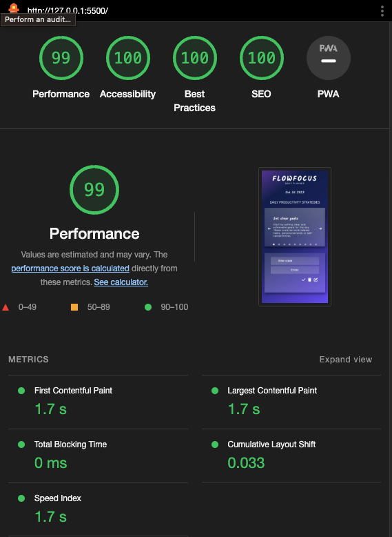
- 

#### Issues

- I hade some issues with a section that was missing a heading, and I got a warning in w3c Validator. So I changed the section to a div, in order to get rid of the warning, because I did'nt want to put a heading there.
- 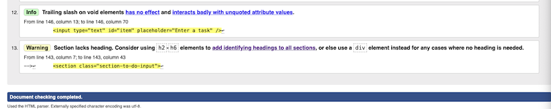

- I had some issues with the Javascript code in JSHint. I got messages that some variables were unused. I finally fixed it with a comment in the beginning of the Javascript code.

- 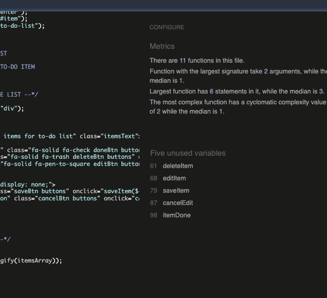

#### Results

- W3c validator for HTML tests.

- 
- 

- W3c css validator for CSS code , Jigsaw.

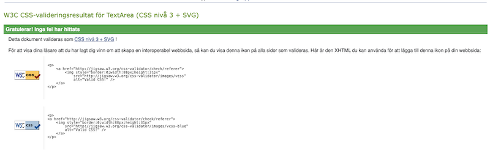

- JSHint test for Javascript code.

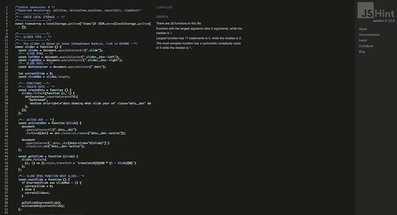

### Manual testing

I tested the website manualy throughout the whole developing progress. The website is tested in Safari, Google Chrome and Brave. The website is also tested from an Iphone.

## Deployment

I deployed early to be able to test the website deployed during the development. Following step are a description of how to deploy a webpage on GitHub:

1. Open the [repository](https://github.com/Annibor/flowfocus-daily-planner) and find the Settings tab.
2. The navigate to the tab called Pages on the left.
3. Choose to Deploy from a branch. For me it was the main branch.
4. Save it. It can take a few minutes, but then you will be able to find the link to the deployed website in the repository on the menu to the right, under [Deployments](https://github.com/Annibor/flowfocus-daily-planner/deployments).
5. There you'll find the daployes website no top of the page under the heading Active deployments.

My link is: [FlowFocus](https://annibor.github.io/flowfocus-daily-planner/)

## Languages

- This website was bulit using HTML, CSS and Javascript.

## Software

- I've used Visual Studio Code to write the code.
- I've used Git to load and push my code to Github and for version control.
- I've used GitHub for repository management.
- I've used Code Pen to test and change my code, without ruining the actual project.
- I've used preinstalled app called "Prevew" to edit the sizes of the photos.
- I've used Coolors.co to find a color palette for the website.
- I've also used Coolors.co to contrast check text colors and background colors.
- I've used maketintsandshades.com to find evetuals tints and shadow colors as a complement for the color palette.
- I've used Balsamiq when I made the wireframes for the website.
- I've used cssgradient.io to make the background gradient.
- I've used Chat GPT and google translate for some translations and questions.

## Media

- Favicons are from favicon.io

## Usage

- This project is available for viewing and can be used for educational purposes.

## Modification

- Any modification, transformation, or extension of this project for commercial or public purposes is not allowed without explicit permission.

## Distrubition

- The redistribution of this project, wheter in its original form or with modifications, is sricktly prohibited without prior consent.

## Private Use

- Feel free to use this project for private purposes, sush as personal reference or study.

## Liability

- The creator of this project shall not be held liable for any adverse outcomes or damages resulting from the use or misapplication of this project. Users are advised to exercise due care and discretion when utilizing the project's resources and functionalities.

## Credits

### Content

- This README is based upon two sourses for guidance: one by Davis Calikes, available at [GitHub](https://github.com/davidcalikes/portfolio-project-one#readme), and another authored by me, available at [GitHub](https://github.com/Annibor/EarthEcho-Studios/blob/main/README.md)
- The slider effect Credit: The captivating slider effect featured in this project is inspired by Jonas Schmedtmann's Advanced DOM Bankist, avalible at [GitHub](https://github.com/jonasschmedtmann/complete-javascript-course/tree/master/13-Advanced-DOM-Bankist).
- The todo list reference: The ToDo List functionality has been developed based on the educational content from the YouTube video titled "How to Build a Todo List App with Local Storage for Beginners: HTML, CSS & JavaScript." Avaliable at [YouTube](https://www.youtube.com/watch?v=SeKQSQDUMDQ). On the "Interactive Todo App Created with Pure Vanilla JavaScript HTML/CSS Part II". avalible at [medium.com](https://medium.com/@bpmikeomo/interactive-todo-app-created-with-pure-vanilla-javascript-html-css-part-ii-d1498b625584). It is based on " Build a todo list in HTML CSS Javascript /easy beginner tutorial". Avaliable at [Youtube](https://www.youtube.com/watch?v=3OqWCGVaOkA).
- Usage, Modification, Distrubition, Private Use and Liability Content: The guidelines pertaining to usage, modification, distribution, private use, and liability are directly derived from my project, accessible at [GitHub](https://github.com/Annibor/EarthEcho-Studios/blob/main/README.md)

### Special Thanks

I would like to express my gratitude to the following individuals who have made a meaningful impact on this project:

- **Michel**: My wonderful boyfriend, whose unwavering support and encouragement have been my constant motivation.

- **Anthony**: My mentor and guide throughout this development journey. Anthony's expertise and insights have been invaluable, contributing significantly to the success of this project.

I am deeply thankful to these remarkable individuals for their significant contributions to this project.

## What I've Learned

During the development of this project, I've gained valuable insights and skills that have enriched my coding journey. Here are some of the key takeaways:

- **Testing in CodePen**: I've learned the importance of using tools like CodePen to test and experiment with code snippets. This practice ensures that I don't inadvertently disrupt working code in my projects.

- **Creating Gradient Backgrounds**: I've acquired the ability to design eye-catching gradient backgrounds in my web projects. This skill has allowed me to enhance the visual appeal of my websites.

- **Utilizing JavaScript**: While I'm far from being an expert, I've deepened my understanding of JavaScript and how it can be leveraged to create interactive and dynamic web content. I'm continually working to improve my JavaScript skills.

- **Continuous Learning**: I've come to realize that web development is an ever-evolving field, and there's always more to learn. This project has motivated me to explore new concepts, libraries, and techniques continuously.

- **Adaptability and Idea Generation**: I've learned the importance of adaptability in the face of project challenges. If the initial idea proves to be too time-consuming or impractical, I've come to realize that it's okey to focus on other new ideas and solutions.

- **Effective Information Search**: My ability to search for and find relevant information on the web has improved significantly. Learning how to access and use online resources efficiently has been a crucial skill in this project.

These lessons have not only contributed to the finnishing of this project but have also improved my overall coding proficiency. I'm looking forward to applying these skills to future projects.
