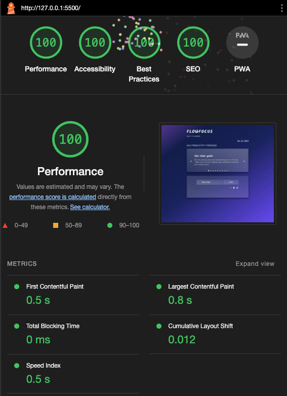
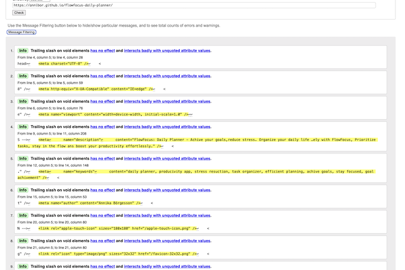
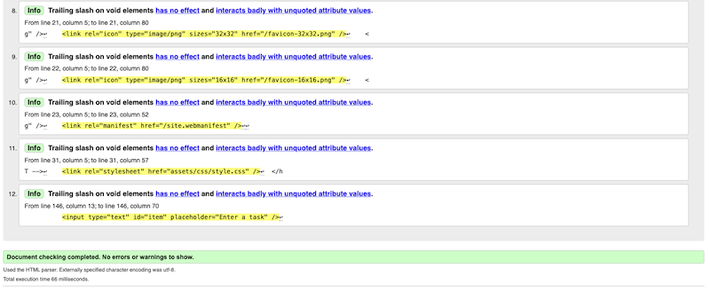

# FlowFocus: Daily Planner

# Introduction

Welcome to FlowFocus, your daily planner to help you achivie your goals, reduce stress and get more organized. In the society we live in today it's easy to feek overwhelmed by responsibilities and evaryday things that triggers stress. FlowFocus is the app thats her to help youm to get a more organized everyday life, so you can save your energy for what matters to you, stay in the flow and boost your productivity effortlessly.

## Table of Content

- [**FlowFocus: Daily Planner**](#flowfocus:-daily-planner)
  - [**Table of Content**](#table-of-content)
  - [**Planning & development**](#planning--developmnet)
    - [**Project Goals**](#project-goals)
    - [**Wireframes**](#wireframes)
      - [**Home Page**](#home-page)
    - [**Colors**](#colors)
    - [**Fonts**](#fonts) -[**Design Philosophy/ Features**](#design-philosophy-features)
  - [**Testing**](#testing) -[**Devtools**](#devtools)
    - [**Ligthouse**](#lighthouse)
      - [**Issues**](#issues)
      - [**Results**](#results)
  - [**Deployment**](#deployment)
  - [**Languages**](#languages)
  - [**Software**](#software)
  - [**Media**](#media) -[**Usage**](#usage) -[**Modification**](#modification) -[**Distribution**](#distrubition) -[**Private Use**](#private-use) -[**Liability**](#liability)
  - [**Credits**](#credits)
  - [**Special thanks**](#special-thanks) -[**What I've learned**](#what-ive-learned)

## Planning & developmnet

### Project Goals

My primary goal with FLowFocus was to cfreate a user-friendly and effective everyday planner, that could help users to organize their tasks ans enhance their productivity. One goal was to provide a solution that encourage self-care, task proritization and goal setting for users to ease their everyday stress.

### User-Centered Approach

The user is placed in the center of the development process, to make sure that the end result would be a userfriendly and user proritized website.

#### As a General user

-FlowFocus is for anyone that is looking for a way to get more organzed in their everyday life.

#### As a Student

- With FlowFocus you can get your tasks in order, and have a clear overview of everything that needs to be done, homework, assigments or small goals that you need to do before the big sumbmission date that's up ahead.

#### As a Business Owner

- FlowFocus can help you to manage your daily tasks and other responsibilities that comes with owning a business. With this app, you could keep you head clear and focus on the task your doing right now, and once your done, mark the task that's done, and move on to the next thing on your to do list.

#### As a New User

- If your new to FLowFocus, you'll discover a welcoming and easy navigated interface. The app is designed with the mind of "Less is more", to make sure that nothing easily could distract the user.

### Wireframes

I created my wireframes for the website by using [Balsamiq](https://balsamiq.com/). I created one wireframe for mobile, tablet and desktop on each page of the website.

#### **Home page**

- [Wireframes for mobile]()
- [Wireframes for tablet]()
- [Wireframes for desktop]()

### Colors

- I used [Coolors](https://coolors.co/) for making a color palette for the website. The color are called : #102E4A
  #55C1FF
  #5887FF
  #715AFF
  #A682FF

- 

I used [Tint and Shades](https://maketintsandshades.com/) to find different tints and shades of the colors from the original color palette. The shades used on this site were: #1A0066
#002EA3
#500AFF

- 

I used [Color Contrast Shecker](https://coolors.co/contrast-checker/112a46-acc8e5) to make sure I used colors that had good contrast to eachother.

- 

I used [CSS Gradient](https://cssgradient.io/) to make the gradient background for the page.

- 

### Fonts

- I used a font called Inter as a base for the page. This is the font used on the subheading on the logo, the heading for the slider and on the text on the page.
- For the logo, date, slides headings and the text on the to do inputs I used a font called Kalam. This to get add some dimention for the webpage, without making it overwhelming.

### Design Philosophy/ Features

- **Header**: A responsive navigation bar,

- 
- 
- 

- **Slider**: A responsive slider section.

### Future Features

Future features for the webpage are:

- A footer with links to social media.
- Being able to mark todo'd as important.
- A way to get reminders of todo's the user mark as important.
- Add audio for button clicks.
- Make heading and subheading gradient in color.
- A function to share lists with others.

## Testing

- Throughout the whole development of the webpage, I've made tests in:

### DevTools

- Troughout the development I've used Devtools to inspect and test the website to be able to make the best I could for it.

### Lighthouse

- 
- 

#### Issues

- I hade some issues with a section that was missing a heading, and I got a warning in w3c Validator. So I changed the section to a div, in order to get rid of the warning, because I did'nt want to put a heading there.
- 

-

#### Results

- W3c validator for HTML tests.

- 
- 

- W3c css validator for CSS code , Jigsaw.

### Manual testing
I tested the website manualy throughout the whole developing progress. The website is tested in Safari, Google Chrome and Brave. The website is also tested from an Iphone.

## Deployment

I deployed early to be able to test the website deployed during the development. Following step are a description of how to deploy a webpage on GitHub:

1. Open the [repository]() and find the Settings tab.
2. The navigate to the tab called Pages on the left.
3. Choose to Deploy from a branch. For me it was the main branch.
4. Save it. It can take a few minutes, but then you will be able to find the link to the deployed website in the repository on the menu to the right, under [Deplyments]().
5. There you'll find the daployes website no top of the page under the heading Active deployments.

My link is: [FlowFocus]()

## Languages

- This website was bulit using HTML, CSS and Javascript.

## Software

- I've used Visual Studio Code to write the code.
- I've used Git to load and push my code to Github and for version control.
- I've used GitHub for repository management.
- I've used Squoosh.app to compromize all images.
- I've used preinstalled app called "Prevew" to edit the sizes of the photos.
- I've used Coolors.co to find a color palette for the website.
- I've also used Coolors.co to contrast check text colors and background colors.
- I've used maketintsandshades.com to find evetuals tints and shadow colors as a complement for the color palette.
- I've used Balsamiq when I made the wireframes for the website.
- I've used cssgradient.io to make the background gradient.

## Media

- Favicons are from favicon.io

## Usage

- This project is available for viewing and may be used for educational purposes.

## Modification

- Modification, including altering, transforming or extending of this project is not permitted fon any commercial or public purposes without explicit permission.

## Distrubition

- The redistribution of this project, wheter in its original form or with modifications, is sricktly prohibited without prior consent.

## Private Use

- Feel free to use this project for private purposes, sush as personal reference or study.

## Liability

- The creator of this project shall not be held liable for any adverse outcomes or damages resulting from the use or misapplication of this project. Users are advised to exercise due care and discretion when utilizing the project's resources and functionalities.

## Credits

### Content

- This README is based upon two sourses for guidance: one by Davis Calikes, available at [GitHub](https://github.com/davidcalikes/portfolio-project-one#readme), and another authored by me, available at [GitHub](https://github.com/Annibor/EarthEcho-Studios/blob/main/README.md)
- The slider effect Credit: The captivating slider effect featured in this project is inspired by Jonas Schmedtmann's Advanced DOM Bankist, avalible at [GitHub](https://github.com/jonasschmedtmann/complete-javascript-course/tree/master/13-Advanced-DOM-Bankist).
- The todo list reference: The ToDo List functionality has been developed based on the educational content from the YouTube video titled "How to Build a Todo List App with Local Storage for Beginners: HTML, CSS & JavaScript." Avaliable at [YouTube](https://www.youtube.com/watch?v=SeKQSQDUMDQ). On  the "Interactive Todo App Created with Pure Vanilla JavaScript HTML/CSS Part II". avalible at  [medium.com](https://medium.com/@bpmikeomo/interactive-todo-app-created-with-pure-vanilla-javascript-html-css-part-ii-d1498b625584). It is based on " Build a todo list in HTML CSS Javascript /easy beginner tutorial". Avaliable at [Youtube](https://www.youtube.com/watch?v=3OqWCGVaOkA).
- Usage, Modification, Distrubition, Private Use and Liability Content: The guidelines pertaining to usage, modification, distribution, private use, and liability are directly derived from my project, accessible at [GitHub](https://github.com/Annibor/EarthEcho-Studios/blob/main/README.md)

### Special Thanks

- **Michel**: My boyfriend
- **Anthony**: My mentor who've been helping me during the developmentprocess.

## What I've learned

- While developing this website I've learned a lot a
